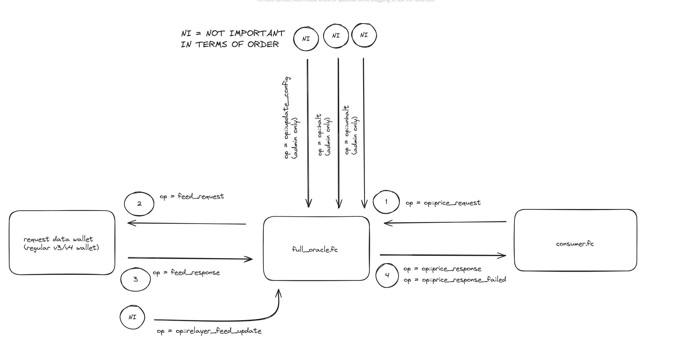

# farmix-oracles

## full_oracle contract overview

This is simpled image of contract op's and theirs flow.
1. `op::price_request`. The consumer (some smart contract which needs asset prices) should send this trx with this op code.
2. `op::feed_request`. After receive op::price_request trx the full_oracle.fc will decide should it use cashed data from storage or request a fresh feeds from outside world.
    If it needs to request fresh feed then it will send trx with `op::feed_request` to special wallet, which later will be discovered by off-chain gateways
3. `op::feed_response`. After off-chain gateways discovers the `op::feed_request` they will send fresh data feeds to full_oracle.fc. 
   The full_oracle.fc will validate data (signers and timestamps) and then cache in the storage. If validation failed the process will be retried until hit retries limit.
4. `op::price_response`. After `op::feed_response` succeeded the response trx send back to the consumer with initial payload (initial consumer payload are proxied through all sequence).  
   `op::price_response_failed`. If after `op::feed_response` something went wrong, for example there was not enough feeds and signers to update cache, then `op::price_response_failed` message
   will be sent back to consumer. The message will not contain feeds, but will contain original proxy payload.

* `op::relayer_feed_update`. The off-chain part of the oracle can send feeds to the oracle contract beforehand. 
   While this can increase the oracle response speed, it requires tons for transaction. The contract has special flag in its config,
   if flag is true, then oracle will take fee from every response to be able to work in relayer mode. The offchain part of the oracle
   will send relayer feeds when wallet has enough ton to send trx and contract cache will expire soon.

Admin and utility ops.
* `op::update_config`. Update (change) full_oracle.fc config (admins, trusted signers, request data wallet, ...etc) (admin only)
* `op::halt`. Stop full_oracle.fc contract, after halt oracle will throw on consumer requests, admin actions will be still available (admin only)
* `op::unhalt`. Resume oracle. full_oracle.fc will start to accept consumer requests after this, if was halted before.

## Project structure
-   `contracts` - source code of all the smart contracts of the project and their dependencies.
-   `wrappers` - wrapper classes (implementing `Contract` from ton-core) for the contracts, including any [de]serialization primitives and compilation functions.
-   `tests` - tests for the contracts.
-   `scripts` - scripts used by the project, mainly the deployment scripts.

## How to use

### Build

`npx blueprint build` or `yarn blueprint build`

### Test

`npx blueprint test` or `yarn blueprint test`

### Deploy or run another script

`npx blueprint run` or `yarn blueprint run`

### Add a new contract

`npx blueprint create ContractName` or `yarn blueprint create ContractName`
